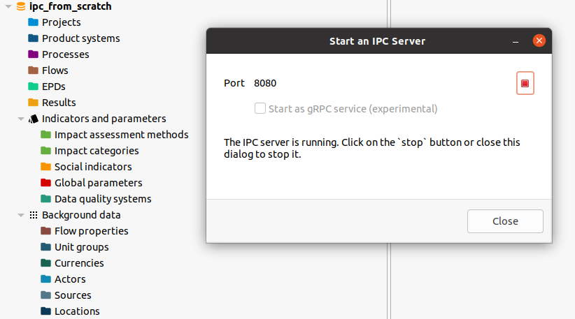

# Python IPC - From scratch

In this section we will go through a complete example using the openLCA IPC
interface from the [olca-ipc.py](https://github.com/GreenDelta/olca-ipc.py)
Python package. As we will create everything from scratch, we first create an
empty database and start an IPC server for that database:



In the Python code, we first import the required packages that we will use in
our example. The `olca-schema` packages comes is a dependency of the `olca-ipc`
package and contains the data type definitions of the openLCA model and some
utility methods. We will use Pandas for formatting our data output and NumPy,
which is a dependency of Pandas, for checking the calculation. Also, we will
add type annotations in our code, compatible with Python 3.11.

```py
{{#include pyipc_from_scratch.py:imports}}
```

## A historic example

Our example was taken from [Heijungs
1994](https://www.sciencedirect.com/science/article/abs/pii/0921800994900388)[^paper]
and extended a bit. First, we define the technosphere of our system which are
4 processes connected by 4 products:


```py
{{#include pyipc_from_scratch.py:techsphere}}
```

When we print this data frame, we get the following table:

|                              | electricity production | aluminium production  | aluminium foil production | sandwitch package production |
|------------------------------|------------------------|-----------------------|---------------------------|------------------------------|
| electricity [MJ]             |                   1.00 |                -50.0  |                      -1.0 |                          0.0 |
| aluminium [kg]               |                  -0.01 |                  1.0  |                      -1.0 |                          0.0 |
| aluminium foil [kg]          |                   0.00 |                  0.0  |                       1.0 |                         -1.0 |
| sandwitch package [Item(s)]  |                   0.00 |                  0.0  |                       0.0 |                        100.0 |

In the rows, we have our products, in the columns the processes. Inputs have
negative and outputs positive values. Thus, for 100 sandwitch packages, we would
need 1 kg of aluminium foil (this is how sandwitches were packed in the 90s)[^no].

Next, we define the interventions of these processes with the environment:

```py
{{#include pyipc_from_scratch.py:envisphere}}
```

|                  | electricity production | aluminium production | aluminium foil production | sandwitch package production |
|------------------|------------------------|----------------------|---------------------------|------------------------------|
| bauxite [kg]     |                    0.0 |                 -5.0 |                       0.0 |                          0.0 |
| crude oil [kg]   |                   -0.5 |                  0.0 |                       0.0 |                          0.0 |
| CO2 [kg]         |                    3.0 |                  0.0 |                       0.0 |                          0.0 |
| solid waste [kg] |                    2.0 |                 10.0 |                       0.0 |                          1.0 |


In the paper, the inventory is calculated for 10 sandwitch packages, which we
can quickly do with NumPy now:

```py
{{#include pyipc_from_scratch.py:numsol}}
```

This gives the expected result:

|                  |       |
|------------------|-------|
| bauxite [kg]     | -1.01 |
| crude oil [kg]   | -5.10 |
| CO2 [kg]         | 30.60 |
| solid waste [kg] | 22.52 |


## Inventory calculations

Now we do the same in openLCA via the IPC interface. First, we create an IPC
client that holds our connection data:

```py
{{#include pyipc_from_scratch.py:mkclient}}
```

As we have nothing in our database, we first need to create the units and flow
properties (quantity kinds) in which the flows of the examples are measured:

```py
{{#include pyipc_from_scratch.py:units}}
```

While IPC server is running, you can also continue to use the openLCA user
interface, just do not close the dialog of the server. When you refresh the
navigation, you will see the newly created unit groups and flow properties:


However, typically you will not create units and flow properties but use the
reference data from openLCA. For example, we can get the flow property `Mass`
by its name:

```py
{{#include pyipc_from_scratch.py:mass}}
```

This will print the JSON serialization of that flow property which is the
internal communication format of the IPC interface (and also the standard
openLCA data exchange format in general):

```json
{
  "@type": "FlowProperty",
  "@id": "b24a123b-f5a1-40fb-a481-afeeb50f6159",
  "lastChange": "2023-01-26T13:36:37.954Z",
  "name": "Mass",
  "unitGroup": {
    "@type": "UnitGroup",
    "@id": "3e912f50-9490-473c-89fc-1393ed2eea03",
    "name": "Mass units"
  },
  "version": "01.00.000"
}
```

---

[^paper]: Reinout Heijungs: A generic method for the identification of options
    for cleaner products. Ecological Economics, Volume 10, Issue 1, 1994, Pages
    69-81, ISSN 0921-8009,
    [https://doi.org/10.1016/0921-8009(94)90038-8](https://www.sciencedirect.com/science/article/abs/pii/0921800994900388).
[^no] it is of course just an illustrative example and not real data
