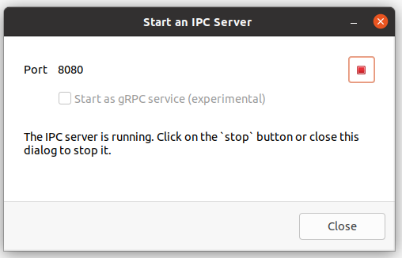

# Introduction

openLCA provides an API for inter-process communication (IPC) that can be used
by any application written in any programming language (e.g. Python,
JavaScript/TypeScript, .Net, Go, etc.)[^java_note]. This IPC protocol is
provided by an openLCA server which can be a running instance of the openLCA
desktop application or a web-server with an openLCA back-end that exposes this
protocol. An application can connect to such an IPC server to call functions in
openLCA:

```

        +--------+                  +--------------------+
        | Client | <--------------> | openLCA IPC Server |
        +--------+                  +--------------------+
                    IPC - Protocol
                    * data management
                    * calculations
                    * result details
                    * ...
```


## Starting an IPC server

In the openLCA desktop application, you can start an IPC server for the
currently active database from the tools menu: `Tools > Developer tools > IPC
Server`. This brings up the following dialog where you can start and stop the
server:



For headless stand-alone servers, please see the next chapter.


## Available protocols

In the dialog, you can select to start a standard IPC server or a
[gRPC](https://grpc.io/) server. The standard IPC server is based on the
[JSON-RPC](https://www.jsonrpc.org/) protocol provided over HTTP. This protocol
is easy to implement as it is just based on JSON and HTTP. For example, it can
be directly used from a web-browser using the [Fetch
API](https://developer.mozilla.org/en-US/docs/Web/API/Fetch_API).

The [gRPC](https://grpc.io/) protocol is another option, especially when you are
already familiar with it or when your platform has good support for this option.
In this case, you can just generate the client side interface from the [openLCA
service declaration](https://github.com/GreenDelta/olca-proto).

A third option is the
[REST](https://en.wikipedia.org/wiki/Representational_state_transfer) API
provided by openLCA web-services. This protocol is also just based on JSON and
HTTP and especially useful when integrating the openLCA back-end into
web-applications.

In this documentation we try to cover all these protocols as they just provide
an interface to the same service back-end of the openLCA kernel. Also, all of
these protocols are based on the [openLCA
Schema](http://greendelta.github.io/olca-schema/) as the data exchange format.
Thus, parameter and return types of the this documentations often link to their
respective description in the openLCA schema documentation.


## Client libraries and example applications

The table below lists some client libraries and demo applications based on the
openLCA IPC protocol:

|                                                                       | Language              | Type           | Protocol       |
| --------------------------------------------------------------------- | --------------------- | -------------- | -------------- |
| [olca-opc.py](https://github.com/GreenDelta/olca-ipc.py)              | Python                | Client library | JSON-RPC, REST |
| [olca-ipc.ts](https://github.com/GreenDelta/olca-ipc.ts)              | JavaScript/TypeScript | Client library | JSON-RPC, REST |
| [ProtoLCA-Demo](https://github.com/msrocka/ProtoLCA-Demo)             | C#                    | Demo           | gRPC           |
| [protolca-js-example](https://github.com/msrocka/protolca-js-example) | JavaScript/Node       | Client library | gRPC           |
| [olcarpc.py](https://github.com/GreenDelta/olcarpc.py)                | Python                | Client library | gRPC           |


----

[^java_note] openLCA is a Java application and if your application is written in
a language that also runs on the Java virtual machine (like Java, Kotlin, Scala,
Clojure etc.) it is recommended to directly use the [openLCA Java
API](https://github.com/GreenDelta/olca-modules) instead of an IPC server. The
kernel of openLCA can be used independently from the user interface and can be
integrated as a set of standard Java libraries in JVM based applications. For
example, the integrated Python editor in openLCA is in fact a Python
implementation for the JVM ([Jython](https://www.jython.org/)), with which you
can call the Java API of openLCA.
